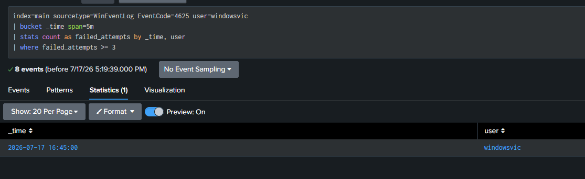
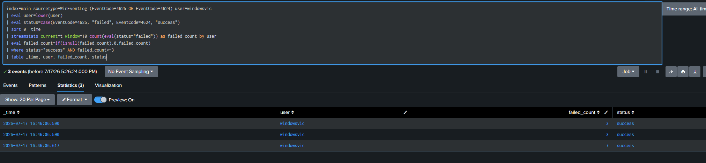
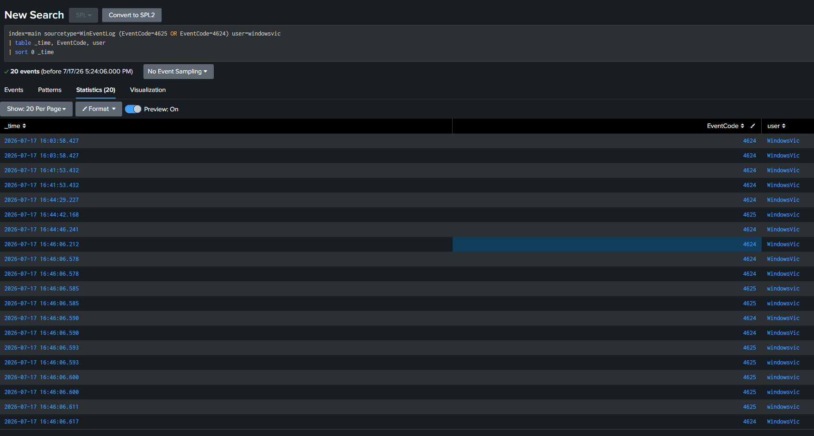

# Security Incident Report — SSH Brute-Force Attack

*A formatted Word version is also available: [`SSH_Brute_Force_Incident_Report.docx`](SSH_Brute_Force_Incident_Report.docx)*

| Field | Value |
|---|---|
| **Report ID** | SIEM-LAB-2026-001 |
| **Analyst** | Brandon White |
| **Environment** | Home SIEM Lab — Splunk Enterprise (Ubuntu indexer) |
| **Date of Activity** | July 17, 2026 |
| **Severity** | Medium (simulated / lab environment) |
| **Status** | Detected — Closed (planned exercise) |
| **MITRE ATT&CK** | T1110 — Brute Force / T1110.001 — Password Guessing |

## 1. Executive Summary

This report documents a controlled SSH brute-force attack simulated against a
Windows 11 endpoint within a self-built home SIEM lab, and the detection
logic built in Splunk to identify it. The exercise validated end-to-end log
pipeline functionality (endpoint → Universal Forwarder → Splunk indexer) and
produced a working correlation search capable of flagging a successful
account compromise following repeated failed authentication attempts.

The attack was launched from a Kali Linux host using Hydra against the
OpenSSH service on the victim endpoint. After a series of failed login
attempts, a valid credential completed a successful authentication —
replicating a realistic brute-force-to-compromise pattern. This activity was
captured in Windows Security Event Logs (Event IDs 4625 and 4624), forwarded
to Splunk, and identified using a custom SPL detection search.

## 2. Environment & Architecture

The lab consisted of three isolated virtual machines on a host-only
VirtualBox network:

- **Splunk Indexer** — Ubuntu Server 24.04, Splunk Enterprise 10.4.1, running
  as a dedicated non-root service account
- **Victim Endpoint** — Windows 11 (Home Edition), Sysmon (SwiftOnSecurity
  config) + Splunk Universal Forwarder, OpenSSH Server enabled
- **Attacker Host** — Kali Linux, Hydra v9.7

Log data flowed from the victim endpoint via the Universal Forwarder over
TCP 9997 to the Splunk indexer, where it was parsed using the Splunk Add-on
for Microsoft Windows for CIM-compliant field extraction (`user`,
`EventCode`, `host`).

## 3. Attack Timeline

| Time | Event | Detail |
|---|---|---|
| 16:44:42 | Failed logon (4625) | First failed SSH authentication attempt from Kali via Hydra, account: `windowsvic` |
| 16:44:46 – 16:46:06 | Multiple failed logons (4625) | Continued brute-force attempts using a small custom wordlist |
| 16:46:06 | Successful logon (4624) | Correct credential included in wordlist; authentication succeeded immediately following the failed attempt cluster |
| 16:46:06+ | Detection search executed | Correlation search identified successful logon preceded by 3+ failed attempts within rolling window |

## 4. Detection Logic

Two detection searches were developed. The first identifies a general spike
in failed authentication attempts (volumetric brute-force indicator); the
second — the primary detection used for alerting — correlates failed
attempts with a subsequent success on the same account, a stronger,
higher-fidelity indicator of an actual compromise rather than noisy
scanning.

### 4.1 Volumetric Detection (Failed Logon Spike)

See [`detections/failed_logon_spike.spl`](../detections/failed_logon_spike.spl)

```spl
index=main sourcetype=WinEventLog EventCode=4625
| eval user=lower(user)
| bucket _time span=5m
| stats count as failed_attempts by _time, user
| where failed_attempts >= 3
```


*Figure 1 — Volumetric detection identifying a 5-minute bucket with 3+ failed logons.*

### 4.2 Compromise Detection (Failed → Success Correlation)

See [`detections/bruteforce_success.spl`](../detections/bruteforce_success.spl)

> **Note:** Windows logs the account name with inconsistent casing between
> event types (e.g. `WindowsVic` on success events vs. `windowsvic` on
> failure events). Since SPL field comparisons are case-sensitive, the
> account name was normalized with `lower()` before correlation to avoid
> silently splitting a single account's activity into two separate groups.

```spl
index=main sourcetype=WinEventLog (EventCode=4625 OR EventCode=4624)
| eval user=lower(user)
| eval status=case(EventCode=4625, "failed", EventCode=4624, "success")
| sort 0 _time
| streamstats current=t window=10 count(eval(status="failed")) as failed_count by user
| eval failed_count=if(isnull(failed_count),0,failed_count)
| where status="success" AND failed_count>=3
| table _time, user, failed_count, status
```


*Figure 2 — Compromise detection: successful logons each preceded by 3+ recent failures.*

### 4.3 Supporting Evidence — Raw Event Sequence


*Figure 3 — Raw indexed events showing the failed-attempt cluster immediately preceding the successful logon.*

## 5. Alerting Configuration

| Setting | Value |
|---|---|
| **Alert Name** | Brute Force Success Detection – SSH |
| **Search** | Section 4.2 correlation query |
| **Schedule** | Cron (`*/5 * * * *`) — every 5 minutes |
| **Trigger Condition** | Number of results > 0 |
| **Trigger Action** | Add to Triggered Alerts |
| **Severity Assigned** | High — indicates a successful compromise, not just scanning activity |

## 6. False Positive Considerations

- A legitimate user mistyping their password 3+ times before succeeding
  would trigger this alert identically to an attacker.
- Shared service accounts with automated retry logic (e.g. scheduled tasks
  with stale credentials) could produce similar patterns.
- **Tuning recommendation:** increase fidelity by requiring the failed
  attempts to originate from a source IP distinct from the eventual
  successful source, or by requiring failures from multiple source IPs
  (indicating distributed guessing rather than a single user's typos).
- In production, this detection would be paired with account-specific
  baselining (e.g. flag only for privileged/service accounts, or accounts
  with no history of recent failed logons).

## 7. Recommendations

- Enforce account lockout policies after a defined number of failed SSH
  authentication attempts.
- Disable password authentication in favor of key-based SSH authentication
  where feasible.
- Deploy `fail2ban` or an equivalent rate-limiting control on
  internet-facing SSH services.
- Extend this detection to include source IP correlation and geolocation
  for distributed brute-force identification.
- Layer in Sysmon Event ID 3 (network connection) data to correlate the
  originating attack source at the process level.

## 8. Conclusion

This exercise validated the full SIEM pipeline from endpoint telemetry
generation through detection and alerting, and produced a working,
documented correlation search mapped to MITRE ATT&CK T1110.001. The
detection logic distinguishes between noisy brute-force scanning and
confirmed account compromise, reflecting a higher-fidelity approach to
alerting suitable for reducing analyst fatigue in a production SOC context.
