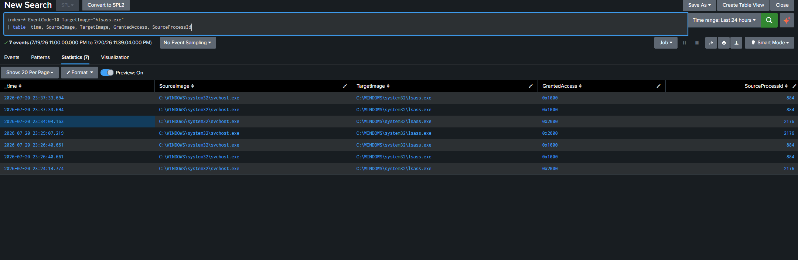
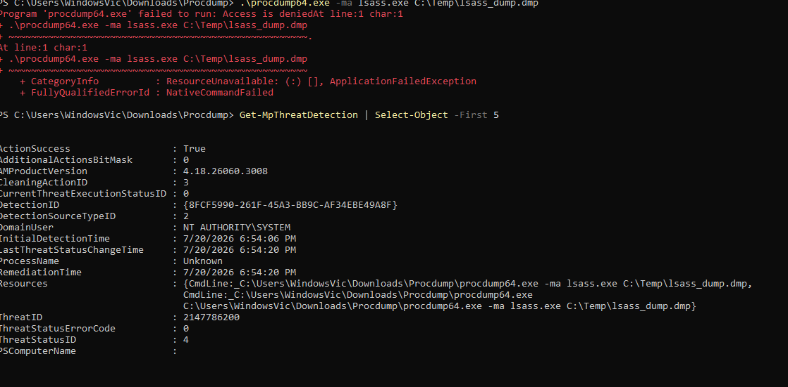
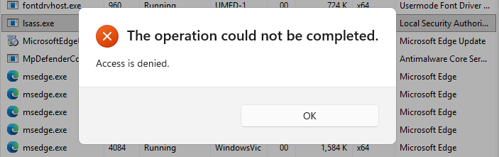

# Incident Report: LSASS Credential Access Detection

**Project:** Splunk SIEM Home Lab

**Detection Focus:** OS Credential Dumping — LSASS Memory

**MITRE ATT&CK Technique:** [T1003.001 – OS Credential Dumping: LSASS Memory](https://attack.mitre.org/techniques/T1003/001/)

**Author:** Brandon White

**Environment:** `victim-win11` (Windows 11 VM) → Sysmon → Universal Forwarder → Splunk

---

## 1. Objective

LSASS (Local Security Authority Subsystem Service) stores credential material in memory, including password hashes and Kerberos tickets. Attackers commonly dump LSASS memory using tools such as Mimikatz, ProcDump, or the built-in Task Manager "Create dump file" feature, then extract credentials offline for lateral movement or privilege escalation.

The goal of this exercise was to:
1. Configure Sysmon to generate telemetry for LSASS process access (Event ID 10 / ProcessAccess).
2. Establish a baseline of normal, legitimate LSASS access.
3. Simulate a credential dumping attempt and validate detection.
4. Document findings — including any real-world defenses encountered along the way.

---

## 2. Detection Configuration

Sysmon's `ProcessAccess` event (Event ID 10) is disabled/empty by default in most baseline configs (including the SwiftOnSecurity template used in this lab), since it is extremely noisy without targeted filtering. The following rule was added to scope logging to only lsass.exe as the access target:

```xml
<ProcessAccess onmatch="include">
    <TargetImage condition="end with">lsass.exe</TargetImage>
</ProcessAccess>
```

Configuration was pushed and verified active:


```
- ProcessAccess    onmatch: include   combine rules using 'Or'
       TargetImage    filter: end with    value: 'lsass.exe'
```

Data ingestion into Splunk was confirmed via the Universal Forwarder, ingesting from:
- **Source:** `XmlWinEventLog:Microsoft-Windows-Sysmon/Operational`
- **Sourcetype:** `XmlWinEventLog`
- **Host:** `victim-win11`

---

## 3. Establishing a Baseline

Before simulating an attack, normal LSASS access patterns were captured to distinguish legitimate activity from malicious behavior.

**Query:**
```spl
index=* EventCode=10 TargetImage="*lsass.exe"
| table _time, SourceImage, TargetImage, GrantedAccess, SourceProcessId
```

**Results:**



| SourceImage | GrantedAccess |
|---|---|
| svchost.exe | 0x1000 |
| svchost.exe | 0x2000 |

All observed baseline activity originated from `svchost.exe`, a legitimate Windows system process, with narrow, low-privilege access rights (`0x1000`, `0x2000` — consistent with `PROCESS_QUERY_LIMITED_INFORMATION`-class access). This is expected: many Windows services query LSASS for authentication-related purposes without ever requesting memory-read access.

This baseline is significant for detection tuning: credential dumping tools request far broader access rights (e.g. `0x1010`, `0x1410`, `0x1438`, `0x143a`), so any access request outside this narrow baseline — particularly from a non-system process — would be a strong indicator of malicious activity.

---

## 4. Simulated Attack Attempts

Two independent LSASS dumping techniques were attempted in the isolated lab VM to validate whether Sysmon/Splunk would capture the resulting `ProcessAccess` event.

### Attempt 1: Sysinternals ProcDump

```
procdump64.exe -accepteula -ma lsass.exe C:\Temp\lsass_dump.dmp
```

**Result: Blocked by Windows Defender.**

Windows Defender's behavior-based detection identified the technique via its **cloud-delivered security intelligence**, independent of file path, hash, or admin/elevation status:



Windows Defender Operational Log (Event ID 1116/1117):

*[Screenshot of the PowerShell `Get-WinEvent` output to be added here — see note below]*

```
Name: HackTool:Win32/DumpLsass.E
ID: 2147786200
Severity: High
Category: Tool
Path: CmdLine:_C:\Tools\ProcDump\procdump64.exe -accepteula -ma lsass.exe C:\Temp\lsass_dump.dmp
Action: Remove
```

Notably, the detection persisted across multiple troubleshooting attempts, including:
- Adding folder- and file-level path exclusions (`Add-MpPreference -ExclusionPath`)
- Re-downloading a fresh, unflagged copy of the binary into a pre-excluded directory
- Attempting to disable real-time protection via `Set-MpPreference -DisableRealtimeMonitoring $true`

The registry evidence explains why: Defender had recorded a **hardcoded default action** for this specific threat ID, independent of standard exclusion mechanisms:

```
HKLM\SOFTWARE\Microsoft\Windows Defender\Threats\ThreatIDDefaultAction\2147786200 = 0x6
```

Additionally, an attempt to disable real-time protection triggered **Tamper Protection** to silently self-correct the configuration change:

```
HKLM\SOFTWARE\Microsoft\Windows Defender\Features\TamperProtection = 0x1 → 0x4
```

### Attempt 2: Task Manager "Create Dump File"

To rule out a command-line signature match as the sole detection mechanism, a second technique was attempted using Task Manager's built-in dump feature (Details tab → right-click `lsass.exe` → Create dump file), which does not involve ProcDump or any matching command-line string.

**Result: Also blocked.**



This confirms the protection is enforced at the **process-access level** for lsass.exe specifically, not merely a signature match against a known tool's command line.

---

## 5. Findings

Because both simulated credential access attempts were intercepted and blocked by Windows Defender before completion, **no `ProcessAccess` (Event ID 10) event was generated for the attack itself** — the configured Sysmon rule and Splunk query were never exercised against real attack telemetry within this test.

This is nonetheless a meaningful and valid finding. It demonstrates **defense-in-depth**: Microsoft Defender's behavioral/cloud-delivered protection intercepted a well-known credential theft technique (T1003.001) upstream of the endpoint telemetry layer, before Sysmon-based detection logic would even need to fire. In a real environment, this is the desired outcome — prevention taking precedence over detection.

Key observations:
- Defender's block was **not path- or hash-based** — it persisted across a freshly downloaded, differently-located binary, indicating detection based on process behavior / command-line pattern matching via cloud-delivered intelligence.
- **Tamper Protection** actively resisted attempts to weaken real-time protection via PowerShell, self-correcting the configuration within moments.
- The block extended beyond ProcDump specifically — Task Manager's native dump feature, a completely different code path, was also denied, indicating protection scoped to lsass.exe process access broadly rather than a single known tool.

---

## 6. Lab Hygiene

Post-testing, all temporary changes were reverted and verified:

```powershell
Get-MpComputerStatus | Select-Object RealTimeProtectionEnabled, IsTamperProtected, AntivirusEnabled
Get-MpPreference | Select-Object -ExpandProperty ExclusionPath
```

Confirmed: real-time protection, Tamper Protection, and antivirus were all active, and no Defender path exclusions remained configured on the VM.

---

## 7. Lessons Learned / Next Steps

- **Sysmon configuration and Splunk pipeline are validated and functioning correctly** — the baseline query confirms end-to-end telemetry flow for `ProcessAccess` events targeting lsass.exe.
- Fully validating the LSASS detection query against real attack telemetry will require either:
  - Testing in a more permissive/isolated lab image without Defender's cloud-delivered protection enabled (e.g. offline VM with security intelligence updates disabled), or
  - Using a T1003.001 sub-technique or tooling less likely to match Defender's known-threat signatures (for research/educational purposes only).
- This exercise reinforced the practical value of **layered defenses** — a lesson directly applicable to SOC/blue-team work: detection engineering doesn't operate in isolation from endpoint protection, and a "clean" test environment isn't always representative of how modern EDR/AV will behave against known attack tooling.
- Next lab item per roadmap: **PowerShell Script Block Logging detection (Event ID 4104)**.

---

## Appendix: SPL Queries Used

**Baseline / General LSASS Access:**
```spl
index=* EventCode=10 TargetImage="*lsass.exe"
| table _time, SourceImage, TargetImage, GrantedAccess, SourceProcessId
```

**Tuned Detection (for future use once validated against real attack telemetry):**
```spl
index=* EventCode=10 TargetImage="*\\lsass.exe"
| where GrantedAccess IN ("0x1010", "0x1410", "0x1438", "0x143a")
| where NOT match(SourceImage, "(?i)(MsMpEng\.exe|Defender|CrowdStrike)")
| stats count by SourceImage, GrantedAccess, Computer, User
```
